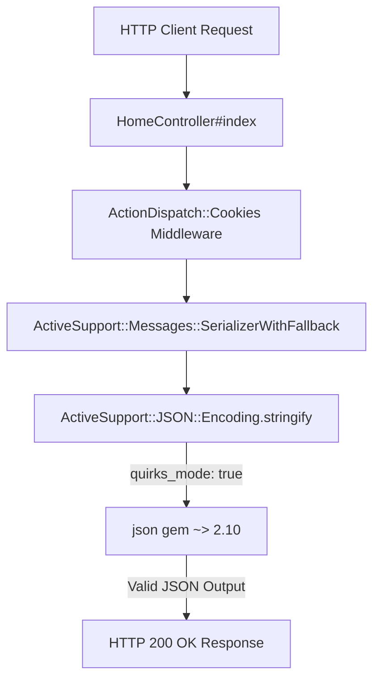

# Requirements

### Overview & Goals
The application encounters a fatal runtime `ArgumentError (unknown keyword: quirks_mode)` when handling requests that serialize cookies or session data (e.g. in `HomeController#index`). The goal is to resolve this incompatibility by pinning the `json` gem to a compatible 2.x version so that `ActiveSupport::JSON::Encoding` and Rails session/cookie serialization work properly.

### Root Cause Analysis
- In `Gemfile.lock`, Bundler resolved `json (3.0.1)` (brought in transitively via `rubocop` which allows `json >= 2.3`).
- In `json` version 3.0.0+, the legacy keyword parameter `quirks_mode` was removed from `JSON.generate`.
- `ActiveSupport` 8.0.5.1 in `lib/active_support/json/encoding.rb` calls `::JSON.generate(data, quirks_mode: true, ...)` when serializing values (including session cookies via `ActiveSupport::Messages::SerializerWithFallback#dump`).
- Because `json 3.0.1` is loaded in the bundle, passing `quirks_mode: true` raises `ArgumentError: unknown keyword: quirks_mode`.

### Scope
- **In Scope**:
  - Updating `Gemfile` to constrain the `json` gem to version `< 3.0` (or `~> 2.10`).
  - Regenerating `Gemfile.lock` to lock a compatible 2.x version of `json`.
  - Verifying application boot and session cookie serialization.
- **Out of Scope**:
  - Modifying Rails or ActiveSupport internal source code.
  - Upgrading other unrelated gems or changing application controller logic in `app/controllers/home_controller.rb`.

### Acceptance Criteria
- Requesting `HomeController#index` or any endpoint setting session/cookies completes with HTTP 200 without throwing `ArgumentError`.
- `Gemfile.lock` locks `json` to a 2.x version compatible with ActiveSupport 8.0.5.1.

# Technical Design

### Current Implementation
- **Files involved**:
  - `Gemfile`: Does not currently contain an explicit declaration for `gem "json"`.
  - `Gemfile.lock`: Contains `json (3.0.1)` resolved under gem dependencies.
  - `app/controllers/home_controller.rb`: Renders `index` action which touches the Rails session cookie middleware.

### Key Decisions
1. **Explicit Version Constraint in Gemfile**:
   - *Decision*: Add `gem "json", "~> 2.10"` to `Gemfile`.
   - *Rationale*: Constraining `json` to `~> 2.10` (or `< 3.0`) prevents Bundler from resolving breaking major versions of the JSON parser until Rails/ActiveSupport adds official support for `json` 3.x.

2. **Scoped Lockfile Update**:
   - *Decision*: Run `bundle update json` rather than updating all gems.
   - *Rationale*: Minimizes risk of unexpected dependency conflicts or regressions across other gems in the bundle.

### Proposed Changes

#### 1. `Gemfile`
Add the `json` gem specification:
```ruby
# Pin json gem to 2.x to maintain compatibility with ActiveSupport JSON encoding
gem "json", "~> 2.10"
```

#### 2. `Gemfile.lock`
Update the resolved `json` dependency from `3.0.1` to a stable `2.x` release (e.g. `2.10.1`).

### Architecture Diagram


# Testing

### Validation Approach
Verify that the `json` gem is locked to 2.x and that Rails session encoding executes without errors.

### Key Scenarios
1. **Dependency Verification**:
   - Verify that `bundle exec ruby -e "require 'json'; puts JSON::VERSION"` outputs `2.x.x`.
2. **Session & Cookie Encoding**:
   - Execute `bundle exec rails runner "puts ActiveSupport::JSON.encode({ test: 'value' })"` to confirm JSON encoding succeeds without raising `ArgumentError`.
3. **Application Request Test**:
   - Run controller / request tests (`bundle exec rails test`) or start the server and request `/` to ensure `HomeController#index` returns HTTP 200.

### Edge Cases
- Ensure dependencies like `rubocop` (which require `json >= 2.3`) remain satisfied by the locked `2.x` version.

# Delivery Steps

###   Step 1: Pin the JSON gem version in Gemfile
The `Gemfile` explicitly specifies a compatible version constraint for the `json` gem (`< 3.0`).

- Open `Gemfile`.
- Add `gem "json", "~> 2.10"` (or `gem "json", "< 3.0"`) to prevent Bundler from resolving `json` 3.x.
- Ensure the dependency is placed in the top-level dependencies section so all environments use the compatible version.

###   Step 2: Update Bundler lockfile to install JSON 2.x
`Gemfile.lock` is updated so that `json` resolves to a compatible 2.x version (such as 2.10.x).

- Run `bundle update json` to downgrade and relock the `json` gem to the latest compatible 2.x release without altering other unrelated gem versions.
- Verify that `Gemfile.lock` reflects the downgrade of `json` from `3.0.1` to `2.x`.

###   Step 3: Validate application boot and session serialization
The Rails server and test suite run successfully with session cookie generation and JSON encoding working without error.

- Run Rails tests / test suite (`bin/rails test` or `bundle exec rake test`) to confirm there are no regression errors.
- Start the server or make a test request to `HomeController#index` to verify that session cookies and JSON serialization succeed without raising `ArgumentError (unknown keyword: quirks_mode)`.